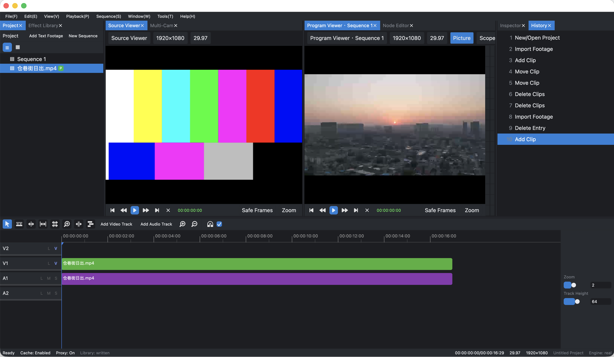

# Oak Video Editor 
 [中文](docs/zh/README.md)

Oak Video Editor is based on Olive, aiming to deliver a more complete and user-friendly editing experience.

## Screenshots

## Features

- Premiere-like keyboard shortcut experience
- OpenFX plugin support — the plugin system used by DaVinci Resolve
- End-to-end color management support
- 10-bit display output
- OCIO LUT support
- Proxy editing workflow
- Timeline interchange with DaVinci Resolve, Premiere Pro, and Final Cut Pro via OpenTimelineIO and Final Cut Pro XML

## Download

[v0.5.1](https://github.com/OakVideoEditorCommunity/oak/releases/tag/v0.5.1-alpha)

## Build Instructions

See the [Build Guide](docs/build.md).

## Roadmap

| Version | Theme | Core Deliverables |
|:--|:--|:--|
| **0.5 (current)** | **Rust Rewrite** | Oak rewritten in Rust |
| **0.6** | **Color, Audio & Performance** | AI video editing, scopes (waveform/vectorscope/histogram), three-way color wheel panel, multicam editing support, BWF timecode sync, audio meters (LUFS/VU), batch render queue |
| **0.7** | **Animation, Tracking & Collaboration** | Bézier keyframe curve editor, basic point tracking, image stabilizer |
| **0.8** | **Stability Milestone** | Project file format freeze (backward compatibility promise) — the "feature freeze" testing period before 1.0 |
| **1.0** | **Production Ready** | Complete documentation, installers, known issues list, community support channels — declared "ready for serious projects" |
